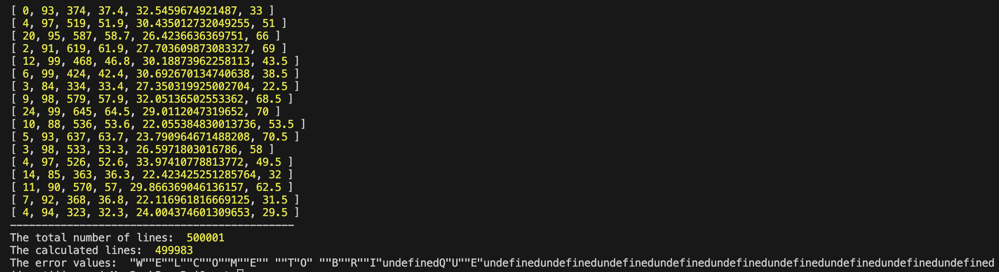
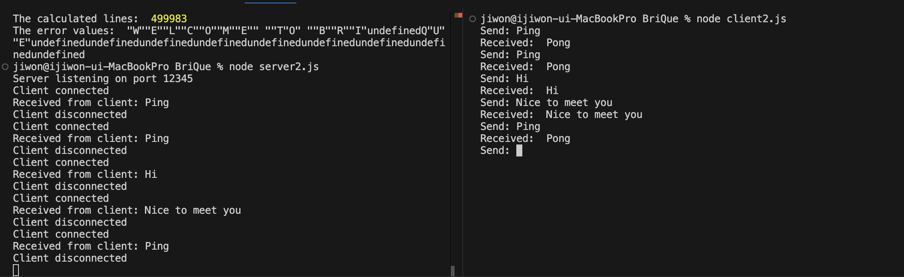
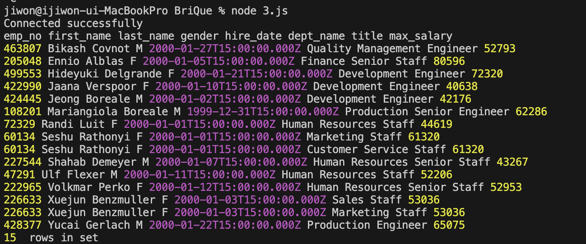
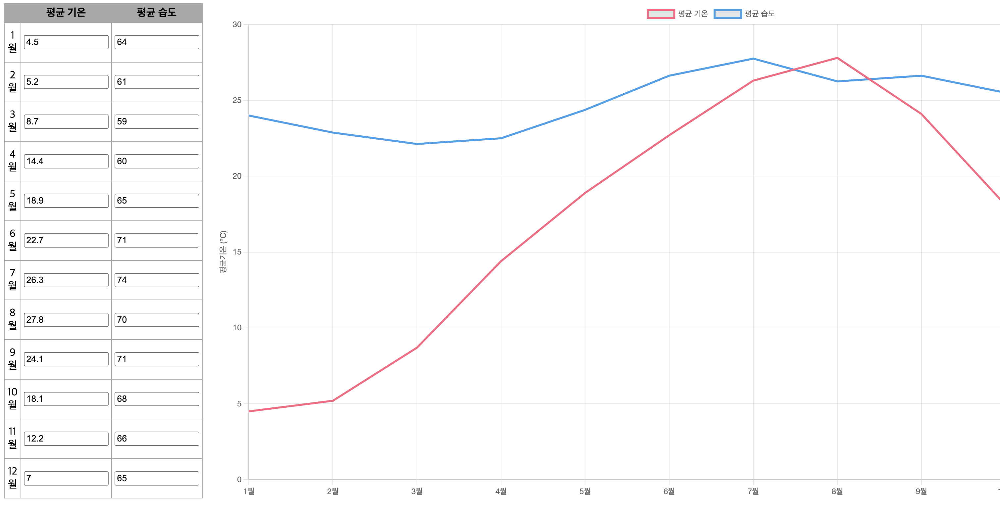
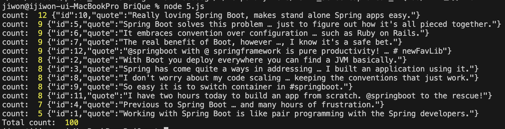

# 브릭 코딩테스트
브릭 코딩테스트입니다.

### 버전정보
* node version : v22.11.0
* npm version : v10.9.0

### 추가적인 라이브러리 설치
* mysql 설치 (v2.18.1)
* net 설치 (v1.0.2)

## 프로젝트 설명 및 실행방법

### 문제 1
---
#### 실행방법
* 터미널 창에 `node 1.js` 입력해주세요.
#### 실행결과

### 문제 2
---
#### 실행방법
* 터미널 창에 `node server2.js` 입력하여 server 실행시켜주세요.
* 다른 터미널 창에 `node client2.js` 입력하여 client 실행시켜주세요.
* client2에 message 입력해주세요.

#### 구현내용
* 서버
    - client에게 메세지를 받으면, 응답을 보내줍니다. (Ping일 경우, Ping을 응답 / Ping이 아닌 경우, client가 보낸 메세지 그대로 응답)
* 클라이언트
    - server에 메세지를 보낸 후, server에서 보낸 메세지 출력합니다.

#### 실행결과

### 문제 3
---
#### 실행방법
* 터미널 창에 `node 3.js` 입력해주세요.

#### 실행결과

### 문제 4
---
#### 실행방법
* `index4.html` 파일 클릭 후, 크롬 창에 띄워주세요.

### 구현내용
* javascript와 html, css를 이용하여 구현했습니다.
* chart.js를 이용하여 그래프 생성하였습니다.
* 평균 온도, 평균 습도의 기본값 세팅 후, 초기에 보여질 수 있도록 하였씁니다.
* 데이터 수정시, 차트에 바로 반영됩니다.
* 랜덤 데이터 생성시, 차트에 랜덤으로 반영됩니다.

#### 실행결과

### 문제 5
---
#### 실행방법
* 터미널 창에 `node 5.js` 입력해주세요.

#### 실행결과

### 문제 6
---
#### 실행방법
* 터미널 창에 `node 6.js` 입력해주세요.

### 문제 7
---
#### 실행방법
* 터미널 창에 `node 7.js` 입력해주세요.
